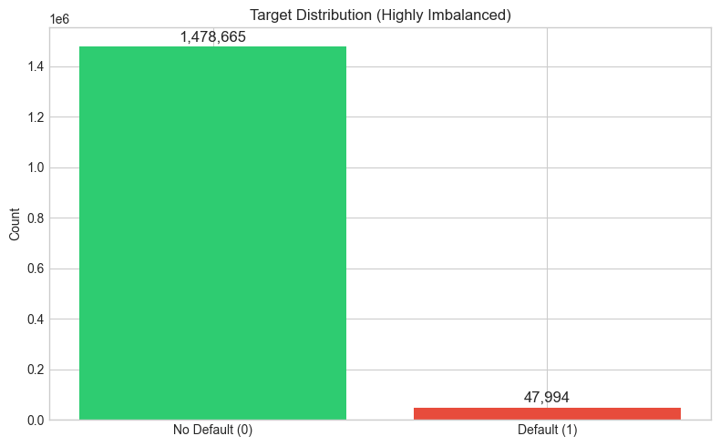
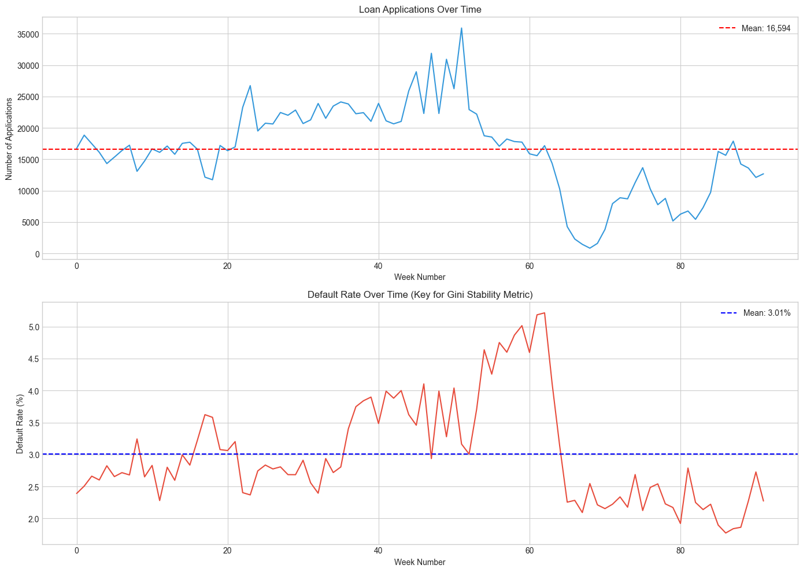
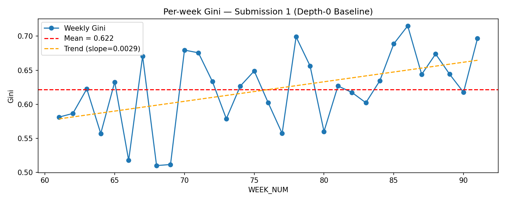
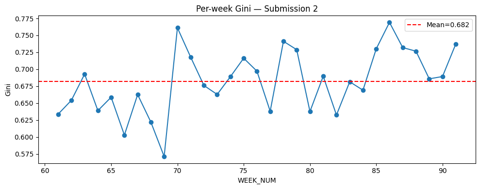

# Home Credit — Credit Risk Model Stability
### Milestone 1

**Imbrea Giulia & Goidan Maeti**
University Assignment — Kaggle Competition

---

## The Problem

**Goal:** Predict whether a loan applicant will default on a loan

Home Credit provides consumer loans to people with **limited credit history** in emerging markets — traditional scoring models often exclude these customers.

**Key twist — it's not just about accuracy:**
The competition scores on a **Gini stability metric** that rewards:
1. Raw predictive power (Gini = 2×AUC − 1)
2. A flat or **improving** trend across weekly buckets
3. **Low variability** in per-week Gini scores

$$\text{Score} = \text{mean Gini} + 88 \times \min(0, \text{slope}) - 0.5 \times \text{std(residuals)}$$

---

## The Data — Scale is the Challenge

| Fact | Value |
|---|---|
| Total size | **~26 GB** uncompressed |
| Training applicants | **1,526,659** |
| Tables | 14 (organized by depth) |
| Weeks of data | **92 weeks** (WEEK_NUM 0–91) |
| Default rate | **3.14%** (heavily imbalanced) |
| Imbalance ratio | **30.8 : 1** |

**Table hierarchy:**
- **Depth 0** — one row per applicant (base, static features)
- **Depth 1** — one-to-many historical records (credit bureau, prev applications)
- **Depth 2** — deeper nested records (installment-level)

---

## EDA — Target Distribution

- Only **47,994 defaulters** out of 1,526,659 applicants
- Handled with `scale_pos_weight = 30.8` in LightGBM
- No imputation needed — LightGBM handles missing values natively

---

## EDA — Temporal Structure

- **92 weeks** of data, roughly uniform application volume
- Default rate varies week to week → must evaluate per week
- **Critical:** using random CV leaks future data — we use **time-based splits only**

---

## EDA — Why Time-Based CV is Essential

**Train/Validation split:**

| Split | Weeks | Rows | Default rate |
|---|---|---|---|
| Train | 0 – 60 | 1,235,013 | 3.26% |
| Validation | 61 – 91 | 291,646 | 2.66% |

The model is always trained on **past weeks** and evaluated on **future weeks** — mimicking real deployment.

> ⚠️ Random CV would give ~0.82 AUC but produce unstable models that degrade on the leaderboard.

---

## Handling the 26 GB Dataset

Training on the **full dataset is resource-intensive** — we used several strategies:

| Challenge | Solution |
|---|---|
| 26 GB raw data | Used **Parquet** instead of CSV (4–5× faster reads) |
| Pandas OOM on joins | Used **Polars** with lazy evaluation |
| Memory during aggregation | Cast all numerics to **float32** (halves RAM) |
| Post-join memory | Explicit `del` + `gc.collect()` after every join |
| Kaggle OOM (30 GB RAM) | Scope discipline — used 4 of 14 depth-1 tables |

We hit **real OOM errors on Kaggle** and solved them iteratively — this is the core scale challenge the professor expects to see discussed.

---

## Submission 1 — Baseline LightGBM (Depth-0 Only)

**Feature sources:** `train_base` + `train_static_0_*` + `train_static_cb_0`
**Total features:** 224

**Design choices:**
- Time-based CV (weeks 0–60 train, 61–91 validate)
- `scale_pos_weight = 30.8` for class imbalance
- Early stopping on validation AUC (50 rounds patience)
- Date columns → days since epoch (integer)
- Categorical columns → integer codes

**Results:**

| Metric | Value |
|---|---|
| Validation AUC | 0.8188 |
| **Gini stability score** | **0.5975** |
| Kaggle public score | 0.4864 |
| Kaggle private score | 0.3995 |

---

## Submission 1 — Per-Week Gini

Positive slope (+0.0029) — model improves over validation weeks ✅

---

## Submission 2 — Depth-1 Aggregations + Stability Filtering

**Added feature sources:** aggregations from 4 depth-1 tables

| Table | Rows | Avg rows/applicant |
|---|---|---|
| applprev_1 | 6.5M | 4.97 |
| credit_bureau_a_1 | 15.9M | 12.25 |
| credit_bureau_b_1 | 85K | 2.35 |
| person_1 | 3M | 1.95 |

**Aggregations per table:** `mean`, `max`, `min`, `std` for numerics; `n_unique` for categoricals → **747 features** before filtering

---

## Submission 2 — Stability-First Feature Filtering

**Key idea:** a feature can be predictive but temporally unstable

**Method:**
1. For each numeric feature, compute its mean per WEEK_NUM on training data
2. Measure **coefficient of variation** (std / |mean|) of weekly means
3. Drop the **10% most drifting** features

**Top 5 dropped features (most unstable):**

| Feature | Drift score |
|---|---|
| mindbdtollast24m_4525191P | 17.57 |
| mindbddpdlast24m_3658935P | 9.61 |
| forweek_1077L | 7.55 |
| cb_b_installmentamount_644A_std | 7.20 |
| cb_b_dpd_733P_max | 7.04 |

**Result:** 747 → **673 stable features**

---

## Submission 2 — Per-Week Gini

Lower residual std (0.0405 vs 0.0483) — more consistent week to week ✅

---

## Results Comparison

| | Submission 1 | Submission 2 |
|---|---|---|
| Approach | Depth-0 only | Depth-0 + 4 depth-1 tables |
| Features | 224 | 673 |
| Val AUC | 0.8188 | **0.8474** |
| **Val Gini stability** | 0.5975 | **0.6618** |
| Residual std | 0.0483 | **0.0405** |
| Kaggle public | 0.4864 | 0.4879 |
| Kaggle private | **0.3995** | 0.3892 |

**Key finding:** Submission 2 improved locally but not on the private leaderboard — depth-1 aggregates introduce temporal drift that the stability filter only partially corrects.

---

## Challenges

**1. Local vs Kaggle score gap**
- Local validation (weeks 61–91) is still close to the training distribution
- Kaggle private test (week 100+) is further in the future → model degrades
- This is the competition's core challenge — hard to detect without future data

**2. Memory management**
- `credit_bureau_a_1` alone is 15.9M rows × 79 columns
- Hit OOM on Kaggle (30 GB notebook RAM) with naive loading
- Fixed by: lazy aggregation, float32 casting, explicit garbage collection

**3. Polars version incompatibilities**
- `schema_overrides` parameter not available in all Polars versions
- Cross-shard dtype mismatches (Int64 vs Float64 for same column)
- Fixed by reading files individually, casting, then `diagonal_relaxed` concat

---

## Proposals for Improvement

1. **More aggressive stability filtering** — drop 20–30% instead of 10%
2. **Drop credit_bureau_a** — largest table, most temporally volatile
3. **Trend features** — compute slope of historical values per applicant instead of just mean/max/min
4. **Walk-forward CV** — multiple time-based folds instead of a single split
5. **CatBoost** — handles categoricals natively, often better than LightGBM on mixed-type data
6. **Hyperparameter tuning** — use Optuna to optimize for gini stability, not just AUC

---

## References

- Kaggle competition: *Home Credit — Credit Risk Model Stability*
  https://www.kaggle.com/competitions/home-credit-credit-risk-model-stability
- Polars documentation: https://docs.pola.rs
- LightGBM documentation: https://lightgbm.readthedocs.io
- scikit-learn `roc_auc_score`: https://scikit-learn.org/stable/modules/generated/sklearn.metrics.roc_auc_score.html
- Kaggle discussion: competition forum threads on stability metric and memory management

---

## Thank You

**GitHub:** https://github.com/MateiGoidan/home-credit

**Submissions:**
- Sub 1 — Baseline LightGBM Depth-0: public **0.4864**, private **0.3995**
- Sub 2 — LightGBM Depth-1 + Stability Filter: public **0.4879**, private **0.3892**
